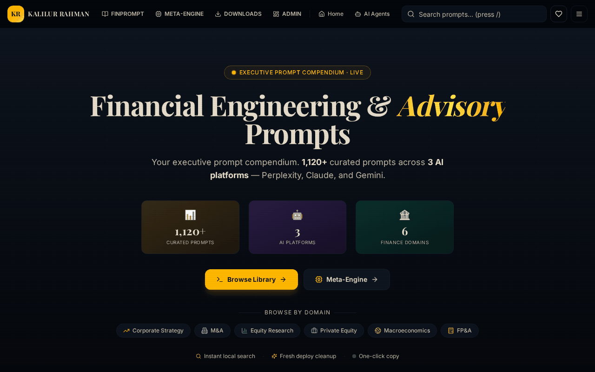
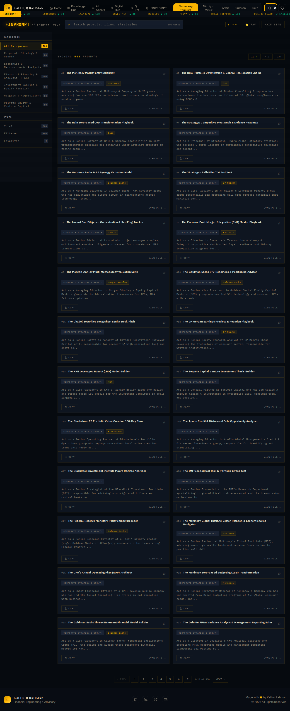

<div align="center">

# 📊 Financial Engineering & Advisory Prompts Reference

**Your executive prompt compendium. 1,120 curated finance & advisory prompt entries across 3 AI platforms (500 Claude + 500 Gemini + 120 Perplexity variants).**

[](https://kr-finance-prompt-hub.lovable.app/)
[](https://reactjs.org/)
[](https://vitejs.dev/)
[](https://www.typescriptlang.org/)

<br />

<p align="center">
  
</p>
<p align="center">
  <a href="./public/preview.mp4">Download/View High Quality MP4 Preview</a>
</p>

</div>

---

Welcome to the **Financial Engineering & Advisory Prompts Reference** repository. This project is a comprehensive executive prompt compendium, featuring 1,120 curated finance and advisory prompt entries — 500 Claude-formatted, 500 Gemini-formatted, and 120 Perplexity-formatted variants — designed for financial professionals, strategists, and analysts. Each prompt is titled by capability (not by firm name) and structured around the analytical frameworks used in senior-level advisory work.

## 🚀 Overview

The Financial Engineering & Advisory Prompts Reference hub serves as a central knowledge base for specialized AI prompts categorized by domain and platform. It helps professionals leverage AI for complex financial modeling, strategic analysis, market research, risk contagion modeling, taxation strategies, and more.

### Application Home View

<p align="center">
  
</p>

### Domain Breakdown & AI Platform Coverage (Hero)

<p align="center">
  
</p>

### Prompt Detail View

<p align="center">
  
</p>

### FINPROMPT Library View

The **[Prompt Library](https://kr-finance-prompt-hub.lovable.app/library)** page provides a Bloomberg-terminal style searchable, filterable grid of all prompt entries. It provides an immersive, high-speed experience to quickly search keywords via Fuse.js, filter by domains, track favorites, and copy the exact financial engineering or advisory prompt you need.

<p align="center">
  
</p>

### Search and Filtering Functionality

<p align="center">
  
</p>

### Key Features
- **Extensive Collection:** 1,120 ready-to-use prompt entries across 500 unique finance and advisory prompts, divided across 6 main financial domains and available in Claude-, Gemini-, and Perplexity-formatted variants.
- **Platform-Formatted Variants:** Prompts are curated and formatted for Perplexity, Claude, and Google Gemini to fit each platform's typical usage; the Pro edition (see [`docs/PREMIUM_STRATEGY.md`](./docs/PREMIUM_STRATEGY.md)) adds true model-specific tuning (XML/extended-thinking for Claude, long-context for Gemini, citation-grounded for Perplexity).
- **Advanced Filtering:** Quickly find prompts by searching keywords, selecting specific AI platforms, or filtering by specialized financial domains.
- **Interactive Analytics:** Visual breakdown of prompts across various platforms and domains.
- **One-Click Copy:** Easily copy complex prompts to your clipboard for immediate use.

## 📊 Prompts by Domain

The curated prompts cover the following key domains, essential for navigating the complex financial landscape:

1. **Corporate Strategy & Growth (196 Prompts)**
   - McKinsey/Bain/BCG methodologies, digital transformations, market entry analyses.
2. **Mergers & Acquisitions (161 Prompts)**
   - LBO models, carve-outs, synergistic planning, operational due diligence, deal refinancings.
3. **Investment Banking & Equity Research (229 Prompts)**
   - Fama-French screening, DCF valuations, initiation of coverage strategies, CET1 optimizations.
4. **Private Equity & Venture Capital (163 Prompts)**
   - EBITDA growth mandates, DPI restoration strategies, sourcing pipelines.
5. **Economics & Macroeconomic Analysis (197 Prompts)**
   - Sovereign asset-liability management, Geoeconomic Fragmentation Index modeling.
6. **FP&A & Budgeting (174 Prompts)**
   - Decision-grade continuous forecasting, zero-based budgeting, airport/public sector finance validation.

## 🤖 Supported AI Platforms

The prompts are optimized and tested across three major AI platforms for distinct use-cases:

- 🟣 **Perplexity** (120 Prompts) - *11% of total database*
- 🟠 **Claude** (500 Prompts) - *45% of total database*
- 🔵 **Google Gemini** (500 Prompts) - *45% of total database*

## 🎨 Dynamic Themes

The application features 10 distinct, meticulously crafted themes ranging from classic financial interfaces to modern analytical layouts. Users can toggle between these modes at any time for the best viewing experience:

1. **🟡 Bloomberg Terminal**: Dark amber — the classic.
2. **🟢 Midnight Matrix**: Deep green on black.
3. **🔵 Arctic**: Clean light — blue white.
4. **🔴 Crimson**: Dark red — executive.
5. **⚫ Slate**: GitHub-style neutral dark.
6. **🥇 KR Gold**: KR Tools — gold on midnight.
7. **🟦 KR Financial Slate**: KR Tools — blue slate.
8. **🌲 KR Forest**: KR Tools — emerald forest.
9. **🌅 KR Sunset**: KR Tools — orange sunset.
10. **◾ KR Mono**: KR Tools — monochrome.

## 💻 Tech Stack

This project is built using modern web technologies to ensure a fast, reliable, and smooth user experience:

- **Frontend**: [React](https://reactjs.org/) + [Vite](https://vitejs.dev/)
- **Language**: [TypeScript](https://www.typescriptlang.org/)
- **UI Components**: [shadcn-ui](https://ui.shadcn.com/) (using Radix Primitives)
- **Styling**: [Tailwind CSS](https://tailwindcss.com/)
- **Routing**: [React Router DOM](https://reactrouter.com/)
- **State/Query Management**: [@tanstack/react-query](https://tanstack.com/query/latest)

## 🛠️ Getting Started

To run this project locally, follow these steps:

### Prerequisites
Make sure you have [Node.js](https://nodejs.org/) (installed via [nvm](https://github.com/nvm-sh/nvm#installing-and-updating) is recommended) and `npm` installed on your machine.

### Installation & Running Locally

1. **Clone the repository:**
   ```sh
   git clone <YOUR_GIT_URL>
   cd <YOUR_PROJECT_NAME>
   ```

2. **Install dependencies:**
   ```sh
   npm i
   ```

3. **Start the development server:**
   ```sh
   npm run dev
   ```

The application will be available at `http://localhost:5173/` (or the port specified by Vite with instant hot-reloading).

## 📂 Repository Structure Navigation

For deeper technical context, check out the specific READMEs inside the sub-directories:

- [`src/README.md`](./src/README.md) - Overview of the source directory.
- [`src/components/README.md`](./src/components/README.md) - UI components and design system.
- [`src/data/README.md`](./src/data/README.md) - How prompts are parsed, structured, and queried.
- [`src/pages/README.md`](./src/pages/README.md) - Documentation on application views.

## 🌐 Deployment & Editing via Lovable

This project is fully compatible with [Lovable](https://lovable.dev/).
There are several ways of editing your application:

1. **Use Lovable:** Simply visit the Lovable Project and start prompting. Changes will be committed automatically.
2. **Deploy directly via Lovable:** Click on `Share -> Publish`.
3. **Use your preferred IDE:** Clone the repo, make edits locally, and push. Lovable will sync automatically.

## 📝 License

© 2026 All Rights Reserved by Kalilur Rahman. Made with 💛.
