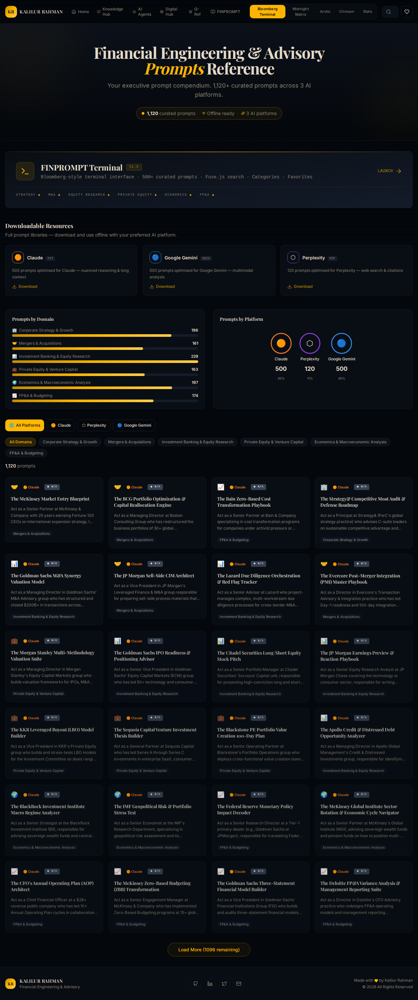
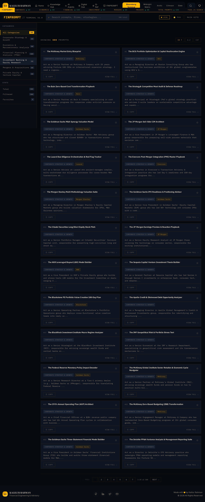
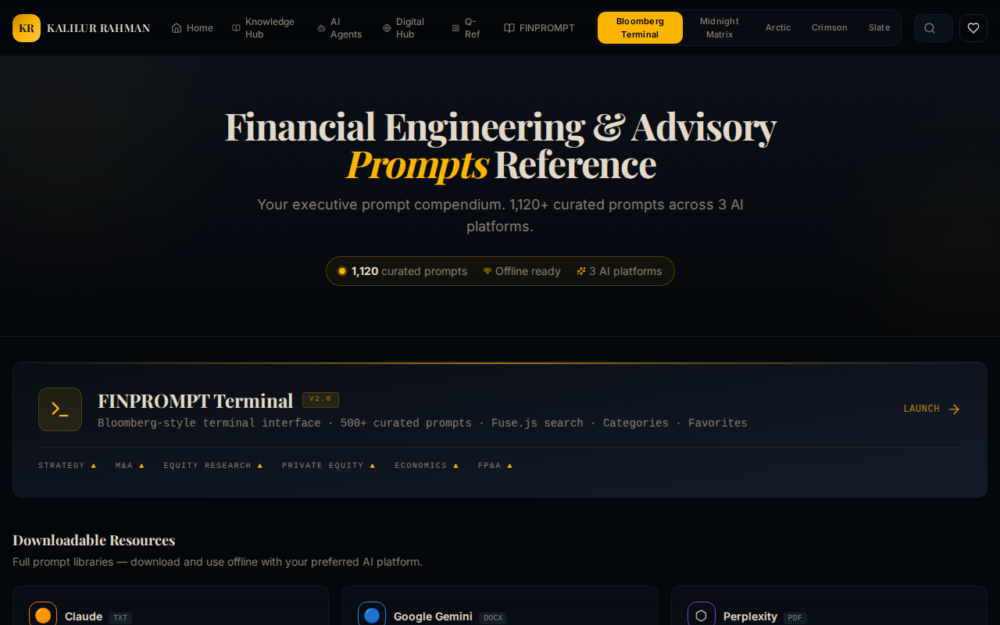
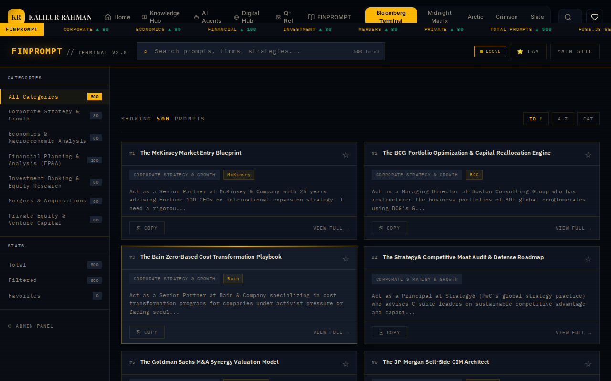

<div align="center">

# 📊 Financial Engineering & Advisory Prompts Reference

**Your executive prompt compendium. 661+ curated prompts across 3 AI platforms.**

[](https://kr-finance-prompt-hub.lovable.app/)
[](https://reactjs.org/)
[](https://vitejs.dev/)
[](https://www.typescriptlang.org/)

</div>

---

Welcome to the **Financial Engineering & Advisory Prompts Reference** repository. This project is a comprehensive executive prompt compendium, featuring 661+ curated prompts designed for financial professionals, strategists, and analysts. These prompts are meticulously structured and tailored for leading AI platforms.

## 🚀 Overview

The Financial Engineering & Advisory Prompts Reference hub serves as a central knowledge base for specialized AI prompts categorized by domain and platform. It helps professionals leverage AI for complex financial modeling, strategic analysis, market research, risk contagion modeling, taxation strategies, and more.

### Application Home View

<p align="center">
  
</p>

### Prompt Library View

<p align="center">
  
### Key Features
- **Extensive Collection:** Over 661 ready-to-use prompts divided across 6 main financial domains.
- **Platform Specificity:** Prompts individually curated and formatted for Perplexity, Claude, and Google Gemini to maximize each model's strengths.
- **Advanced Filtering:** Quickly find prompts by searching keywords, selecting specific AI platforms, or filtering by specialized financial domains.
- **Interactive Analytics:** Visual breakdown of prompts across various platforms and domains.
- **One-Click Copy:** Easily copy complex prompts to your clipboard for immediate use.

### Application Preview

<p align="center">
  
</p>

### Domain Breakdown & AI Platform Coverage

<p align="center">
  
</p>

### Prompt Detail View

<p align="center">
  
</p>

## 📊 Prompts by Domain

The curated prompts cover the following key domains, essential for navigating the complex financial landscape:

1. **Corporate Strategy & Growth (260 Prompts)**
   - McKinsey/Bain/BCG methodologies, digital transformations, market entry analyses.
2. **Mergers & Acquisitions (78 Prompts)**
   - LBO models, carve-outs, synergistic planning, operational due diligence, deal refinancings.
3. **Investment Banking & Equity Research (94 Prompts)**
   - Fama-French screening, DCF valuations, initiation of coverage strategies, CET1 optimizations.
4. **Private Equity & Venture Capital (43 Prompts)**
   - EBITDA growth mandates, DPI restoration strategies, sourcing pipelines.
5. **Economics & Macroeconomic Analysis (88 Prompts)**
   - Sovereign asset-liability management, Geoeconomic Fragmentation Index modeling.
6. **FP&A & Budgeting (98 Prompts)**
   - Decision-grade continuous forecasting, zero-based budgeting, airport/public sector finance validation.

## 🤖 Supported AI Platforms

The prompts are optimized and tested across three major AI platforms for distinct use-cases:

- 🟣 **Perplexity** (500 Prompts) - *76% of total database*
- 🟠 **Claude** (140 Prompts) - *21% of total database*
- 🔵 **Google Gemini** (21 Prompts) - *3% of total database*

## 💻 Tech Stack

This project is built using modern web technologies to ensure a fast, reliable, and smooth user experience:

- **Frontend**: [React](https://reactjs.org/) + [Vite](https://vitejs.dev/)
- **Language**: [TypeScript](https://www.typescriptlang.org/)
- **UI Components**: [shadcn-ui](https://ui.shadcn.com/) (using Radix Primitives)
- **Styling**: [Tailwind CSS](https://tailwindcss.com/)
- **Routing**: [React Router DOM](https://reactrouter.com/)
- **State/Query Management**: [@tanstack/react-query](https://tanstack.com/query/latest)

## 🛠️ Getting Started

To run this project locally, follow these steps:

### Prerequisites
Make sure you have [Node.js](https://nodejs.org/) (installed via [nvm](https://github.com/nvm-sh/nvm#installing-and-updating) is recommended) and `npm` installed on your machine.

### Installation & Running Locally

1. **Clone the repository:**
   ```sh
   git clone <YOUR_GIT_URL>
   cd <YOUR_PROJECT_NAME>
   ```

2. **Install dependencies:**
   ```sh
   npm i
   ```

3. **Start the development server:**
   ```sh
   npm run dev
   ```

The application will be available at `http://localhost:5173/` (or the port specified by Vite with instant hot-reloading).

## 📂 Repository Structure Navigation

For deeper technical context, check out the specific READMEs inside the sub-directories:

- [`src/README.md`](./src/README.md) - Overview of the source directory.
- [`src/components/README.md`](./src/components/README.md) - UI components and design system.
- [`src/data/README.md`](./src/data/README.md) - How prompts are parsed, structured, and queried.
- [`src/pages/README.md`](./src/pages/README.md) - Documentation on application views.

## 🌐 Deployment & Editing via Lovable

This project is fully compatible with [Lovable](https://lovable.dev/).
There are several ways of editing your application:

1. **Use Lovable:** Simply visit the Lovable Project and start prompting. Changes will be committed automatically.
2. **Deploy directly via Lovable:** Click on `Share -> Publish`.
3. **Use your preferred IDE:** Clone the repo, make edits locally, and push. Lovable will sync automatically.

## 📝 License

© 2026 All Rights Reserved by Kalilur Rahman. Made with 💛.
