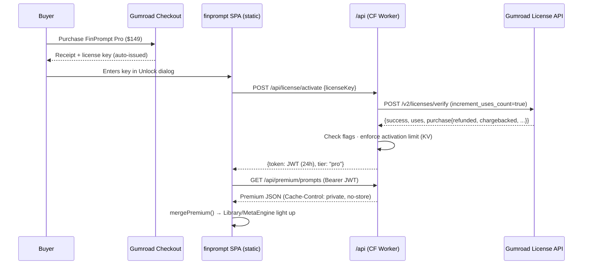

# FinPrompt Premium — Commercial Strategy & Licensing Blueprint

**Prepared:** July 2026 · **Scope:** finprompt.kalilurrahman.com + kr-finance-prompt-hub
**Goal:** Take the free prompt library to a world-class, book-quality, pay-per-access premium product sold via Gumroad (or similar), with managed license tokens — and an outstanding commercial engine around it.

---

## 0. Executive Summary

FinPrompt today is a well-built free product with real domain substance — and zero commercial infrastructure. Everything ships in the client bundle, full-library downloads are public, there is no email capture, no analytics, no payment rail, and no legal layer. The honest premium core is **~120 excellent prompts (ids 1–120)**; the rest of the claimed 1,120+ needs cleanup (byte-identical "Claude" duplicates, 380 entries with header debris, mis-categorized blocks, a dead Perplexity tail).

The strategy in one paragraph:

> **Keep the free site free — it is the marketing engine, not the product.** The premium product is a *new, derivative* artifact: "Pro editions" of every prompt on a gold-standard schema (scenario framing, true model-specific variants, worked examples with real numbers, output rubrics, prompt chains, pitfalls, compliance notes) — content that does not exist today and therefore *can* be gated. Sell it as a 3-tier ladder ($49 / $149 / $299 + team licenses) through **Gumroad to launch** (fastest path, native license keys, affiliates) with a **platform-agnostic license layer** on Cloudflare Pages Functions so you can migrate to Polar.sh (5.6% fees vs Gumroad's ~13.4%) once revenue justifies it. License tokens are managed server-side: Gumroad-issued keys → serverless verification → short-lived JWTs → premium content API that never ships premium bytes in the static bundle. GTM centers on LinkedIn + programmatic SEO + an email funnel, aimed at a **December 2026 soft launch (L&D budget flush)** and **January 2027 full launch (bonus season)**.

Realistic 12-month revenue: **$12–15k conservative, $45–55k base, $150k+ upside** (details in §9). The single biggest risks are legal, not technical: real-firm branding on prompts ("The Goldman Sachs...", "Act as a Senior Partner at McKinsey") and inflated marketing claims ("1,120+ prompts", "500 optimised for Claude") must be fixed **before** the first dollar changes hands (§7).

---

## 1. Ground Truth: Where the Product Stands Today

An honest audit (verified against the codebase and data files) — every strategy decision below flows from these facts:

### 1.1 What's genuinely strong
- **Real practitioner vocabulary.** The best prompts use ARPOB, fulcrum creditor, TWCF, conduit CMBS vs SASB, Freddie K-series — far above "act as a financial expert" slop. This is the core asset.
- **Prompts 1–120 have real architecture:** persona → objective → sectioned deliverables → explicit output format → structured input placeholders (`My inputs: [BRAND | LTM REVENUE | ...]`).
- **The app layer outclasses the content layer.** The Meta Engine (variable detection, fill tracking, suggestion chips, sample-output linking, MD/HTML/PDF export) is a genuinely differentiated product shell — most competitors sell PDFs.
- **~240 credible sample outputs** in `examples.json` demonstrate what the prompts produce (e.g., the Tata Power → Indonesia example cites Presidential Regulation 112/2022, PLN JV structure, USD 55/MWh PPA math).

### 1.2 What must be fixed before charging money
| Issue | Evidence | Fix effort |
|---|---|---|
| "Claude-optimised" set is a duplicate | 499/500 prompts byte-identical to the Gemini set; zero Claude-specific technique | Write real variants or drop the claim |
| Header debris in prompt bodies | 380/500 Gemini entries start with `PROMPT NNN — Title` inside `prompt_text` — users copy it into their AI | ~Hours (scriptable) |
| Block-assigned categories | Categories flip at ids 81/161/241/321/401 regardless of content — a Japan equity strategy prompt filed under M&A, a PE CDMO thesis under Economics | ~1–2 days (script + review) |
| Perplexity prompts don't use Perplexity | 0/500 request citations or recency; 0 have input placeholders; ids >120 are filtered out and never shown (`prompts.ts`) | Rewrite top ~120 |
| Placeholder stubs in examples | 109 literal placeholder entries in `examples.json` | Delete immediately |
| Everything is public and unprotected | All corpora ship in the JS bundle; `public/downloads/` holds full-library TXT/DOCX/PDF; Resources page has one-click full-JSON export | See §5 — architecture change |
| No commercial infrastructure | No email capture, no server analytics (clicks are localStorage-only), no payments, no ToS/privacy policy | See §6–§7 |
| Marketing claims vs reality | "1,120+ prompts" ≈ 500 unique; "optimised per platform" is false today | Correct copy pre-launch (§7) |

**Grades (as a paid product, today):** Rigor B · Consistency D+ · Differentiation C– · Usability B– · "Would an IB VP pay?" D+ → **Overall C+.** After the §2 rework: a defensible A– product in a market whitespace.

---

## 2. Product Strategy: From Free Library to Premium Flagship

### 2.1 The central constraint — what's public stays public

The existing 1,120 prompts are in the deployed JS bundle, in `/downloads/`, and cached by CDNs and archive.org. **They cannot be un-published.** Any "premium" defined as *gating existing content* would be both futile (already scraped) and reputation-damaging (paywalling what was free).

Therefore: **premium = new derivative artifacts layered on top.** The free text remains free forever (and becomes the demo/SEO engine). The paid product is everything a model can't trivially self-generate and that doesn't exist publicly:

- Enriched "Pro editions" on the gold-standard schema (§2.2)
- True model-specific variants (Claude XML/extended-thinking, Gemini long-context/doc-upload, Perplexity search-grounded with citation requirements, ChatGPT)
- Worked examples with realistic numbers + annotated outputs
- Output rubrics (lets the buyer *grade* the AI's answer)
- Multi-step prompt chains mapped to named finance processes
- Excel/Python-integrated prompts, document-grounded ("upload the 10-K") variants
- Quarterly re-testing against new model releases (the recurring-revenue justification — "prompt rot" is documented and real)

This also answers the existential buyer objection — *"why buy prompts when ChatGPT writes prompts?"* A model can generate prompt text; it cannot give you tested outputs on realistic finance data, named-process workflows, per-model regression testing, or compliance-safe framing. Sell the **system**, not the strings.

### 2.2 "Book quality," defined: the gold-standard schema

Every premium entry conforms to this structure (the existing ids 1–120 already contain ~40% of it):

```jsonc
{
  "id": "MA-014",
  "title": "Sell-Side Carve-Out CIM Architect",        // capability-first, NOT firm-branded
  "domain": "M&A", "subdomain": "Sell-side advisory",
  "seniority": "Analyst | Associate | VP | MD",
  "scenario": "3–4 sentences of situational framing (6 weeks to launch, no standalone financials, sponsor pressure...)",
  "prompt": {
    "role": "…",                                        // persona without persona-inflation
    "context_slots": [{ "name": "LTM_REVENUE", "type": "currency", "example": "$500M",
                        "where_to_find": "audited P&L / Capital IQ" }],
    "task": "…",
    "constraints": [
      "Label every figure as INPUT, DERIVED, or ESTIMATE",
      "State the 3 assumptions most likely to be wrong",
      "Do not fabricate market data — request it or flag it"   // anti-hallucination guardrails
    ],
    "output_format": "…"
  },
  "variants": { "claude": "XML-tagged / extended thinking", "gemini": "long-context, doc-upload",
                "perplexity": "search-grounded, cite every figure, filings > transcripts > press",
                "chatgpt": "…" },
  "worked_example": { "inputs": {…}, "abridged_output": "…", "annotations": "3 margin notes on why it's good" },
  "output_rubric": ["Synergy buckets quantified?", "EBITDA bridge internally consistent?", "Estimates flagged?"],
  "follow_up_chain": ["Stress-test the base case", "Convert to board memo", "Red-team the thesis"],
  "pitfalls": ["Model will invent comps multiples — paste real ones", "Watch stale rate assumptions"],
  "data_sources": ["10-K Item 7", "FactSet", "PitchBook", "FRED DGS10"],
  "compliance_note": "Educational framework only; not investment advice; verify before external use.",
  "tags": [], "difficulty": 2, "est_tokens_out": 3000
}
```

Only 1 prompt in ~1,500 today contains any anti-fabrication guardrail. For an audience that gets fired for wrong numbers, the constraints/rubric/pitfalls fields are the difference between a tool and a liability — and they're precisely what justifies the price. Bonus: rubric, pitfalls, and chains map directly onto new Meta Engine UI panels, so content and product upgrade share one schema.

### 2.3 The cleanup sprint (highest ROI-per-hour in the whole plan — do first)

1–2 days of scripted work, before any editorial or build effort:
1. Strip `PROMPT NNN —` headers from 380 entries (regex).
2. Re-categorize by content, not id-block (keyword pass + manual review of flags).
3. Deduplicate Gemini↔Claude; stop counting duplicates.
4. Delete the 109 placeholder stubs and 4 `examples_old*.json` files (~2.2 MB dead weight).
5. Correct all public counts/claims (`manifest.json`, `Resources.tsx`, README, hero stats).
6. Rename firm-branded titles to capability-based titles (§7 — legal gate).

### 2.4 Content build: V1 premium library

| Segment | Count | Action | Effort |
|---|---|---|---|
| Ids 1–120 core | 120 | Enrich to full schema | 30–45 min each |
| Ids 121–500 | 380 | Fix container, expand telegraphic style; ~250–300 survive dedup | ~1 hr each |
| Perplexity 1–120 | 120 | Systematic rewrite as true research prompts (citations, recency, source hierarchy) | 20–30 min each |
| Perplexity 121–500 | 380 | Discard ~300; rebuild ~80 best | — |
| Sample outputs | 550 | Keep ~270 with editing; regenerate on current models with consistent labels | scripted + review |

**V1 scope recommendation: 150–200 Pro prompts + 8–10 flagship chains** (not all 400). Total effort ~350–500 editorial hours for the full library — 2–3 person-months of a finance-literate editor with AI assistance. A smaller, excellent V1 in January beats a complete library in June; the remaining rework becomes your update stream ("new pack every quarter"), which is the retention engine.

**Flagship chains (the hero SKUs — name them after processes, not models):** Deal Sprint (screen → thesis → LBO → IC memo → 100-day plan) · Month-End Close Companion · 13-Week Cash Flow Builder · Earnings Season Pack · Board Deck Builder · Credit Memo Writer · Variance Commentary Engine · CIM Drafting Suite.

**Expansion domains** (missing buyer segments, roughly in priority order): corporate treasury, credit risk & commercial lending, restructuring (first-class), investor relations, technical accounting/audit (ASC 606/842/805, SOX), wealth management, ESG/climate, real estate (partly a relabeling of existing misfiled prompts), insurance, digital assets.

### 2.5 The product ladder (SKUs)

| SKU | Contents | Price |
|---|---|---|
| **Free site** | Current library (cleaned), Meta Engine, teaser Pro entries (2–3 fully visible as proof) | $0 — the funnel |
| **Domain Pack** (e.g. *FP&A Pro Pack*) | ~40 Pro prompts + 2 chains + worked examples, one domain | **$49** |
| **FinPrompt Pro** ⭐ most popular | Full Pro library (150–200), all chains, sample-output library, 12 months of updates | **$149** (founding-member $99) |
| **FinPrompt Pro Lifetime** | Everything + lifetime updates + all future packs + bonus (manager-approval email template, data-safety one-pager) | **$299** |
| **Team 5-seat** | Pro Lifetime × 5, invoice available, seat management | **$499** |
| **Team 20-seat** | + priority support, onboarding call | **$1,499** |
| *(Phase 2)* **Pro Membership** | Quarterly re-tested releases, new packs, changelog SLA, community/office hours | **$199/yr** |

Three-tier anchoring: $49 is the decoy/entry, $149 is the target, $299 + team tiers are the anchor that makes $149 look trivial. Commercial/team pricing at 3–5× personal is the digital-product norm. The "Team License — invoice available" line item is itself a conversion asset for individual buyers (signals a serious product).

---

## 3. Pricing Rationale & Market Position

The market has a visible **whitespace at $99–$499**: below it, $3–8 PromptBase listings and $5–20 Etsy packs (commodity); above it, $599–$999 Maven cohorts, the $1,000/yr AI Finance Club, and the $4,800 Columbia×Wall Street Prep certificate. The closest pure-prompt competitor (AI Blueprint's accountant pack) sells at CA$47 with none of FinPrompt's product shell. The category leader (Nicolas Boucher) proves the finance audience pays $67→$199→$599→$1,000/yr up a ladder — and maintains a *"how to expense your membership"* page, confirming employer L&D budgets are the real wallet.

Demand tailwinds: 59% of finance functions use AI but only 7% report high impact; skills are the #1 cited barrier (Gartner 2025-26); FP&A AI adoption jumped from ~6% to ~41–47% in a year; JPMorgan's internal LLM tooling (230k+ employees) normalizes AI-assisted banking — everyone *without* internal tooling is the buyer.

Pricing psychology to bake into the sales page: sell hours-saved ("saves 2 hours in week one or full refund"), instant invoices/receipts, a pre-written manager-approval email as a checkout bonus, PPP pricing (ParityDeals) for India/SEA/MENA buyers, and a 30-day guarantee with a stated abuse posture (§7.4).

**Beachhead ICP: FP&A / CFO-office professionals.** Four buyer personas span the library (consulting, IB, PE, FP&A), but FP&A has the most validated willingness-to-pay, the most expense-able price point, the clearest seasonal hooks (annual planning, close, budget flush), and the category leader proves the channel. IB/PE is wave two (January bonus season); consulting third.

---

## 4. Sales Platform: Gumroad vs the Field

Verified fees and license-API quality (July 2026), effective take on a $79 sale, entry plan, domestic US card:

| Platform | Fee on $79 | Merchant of Record | License API | Subscriptions | Affiliates | Verdict |
|---|---|---|---|---|---|---|
| **Gumroad** | $10.99 (13.9%) | Yes (since 1/2025) | 3/5 — verify endpoint + uses counter, disable/rotate | Yes | **Built-in** | **Launch here** |
| **Polar.sh** | $4.45 (5.6%) +~0.5% payout | Yes | 4.5/5 — validate/activate/deactivate, quotas, sandbox | Yes | 3rd-party | **Migrate here at scale** |
| Lemon Squeezy | $4.45 (5.6%) | Yes | 5/5 | Yes | Built-in (+3%) | Avoid: being folded into Stripe Managed Payments; forced migration likely |
| Whop | ~$4.80 (6.1%)+ | US/EU/UK mode | 3/5 | Yes | Native + marketplace | Fits trading audiences; brand clashes with premium professional positioning |
| Stripe Links (+Tax) | $2.99 (3.8%) | **No** — you file VAT | DIY | Yes | 3rd-party | Cheapest, highest burden; revisit when Managed Payments exits preview |
| Paddle | $4.45 (5.6%) | Yes | 1/5 (BYO) | Yes | 3rd-party | AUP rejects "content" products — real onboarding risk |
| Payhip / Ko-fi / GH Sponsors | 8.3% / 8.3% / 0% | No | 3 / 0 / 0 | — | — | Fallback / no / secondary dev-audience channel only |

**Recommendation — dual-track:**

1. **Launch on Gumroad** (user preference, fastest to first sale). What it gives you: auto-issued license keys per purchase, a free verify API, versioned product tiers, multi-seat licensing ("choose number of seats"), discount codes, **native affiliates** (the highest-converting channel for digital products, ~6.8%), PWYW lead magnets, upsells/order bumps, full merchant-of-record tax handling, and per-buyer PDF stamping.
2. **Build the license layer platform-agnostic** (§5) — a single adapter function talks to Gumroad today; adding Polar is a config change, not a rebuild.
3. **Migrate primary checkout to Polar.sh at ~$1–2k/mo revenue**, where Gumroad's ~8-point fee premium starts costing real money ($1,200+/yr at base case). Polar: full MoR, modern license API with sandbox, embedded checkout on your own domain, 5.6% → 3.8% on the $20/mo plan.

**Gumroad-specific risk management** (their support/moderation reputation in 2025–26 is poor — Trustpilot ~1.4, documented payout freezes): sweep balances weekly, keep a continuously exported customer CSV, never buy your own product (fraud flag), treat your email list as the system of record, and keep a pre-configured secondary checkout you can swap in via a single link change.

---

## 5. License Token Management Architecture

This is the part most prompt sellers get wrong. The design principle:

> **Premium bytes must never exist in the static origin.** Client-side gating of bundled content is theater — the current bundle proves it (all 1,120 prompts are recoverable with `curl | grep`). Verification must happen server-side, and premium content must only ever travel to verified holders of a live license.

### 5.1 Recommended architecture: static SPA + serverless license API (Cloudflare Pages + Functions)

Keeps ~$0/mo running costs, no accounts/passwords/PII database, genuine security. Migrate hosting from GitHub Pages to Cloudflare Pages (same repo, same custom domain — preserve every URL and add 301s; the SEO strategy depends on it). Functions live in `functions/api/` in this repo; premium JSON lives with the function or in KV/R2 — **never under `public/`**.



### 5.2 API design

```
POST /api/license/activate
  req:  { licenseKey }
  → Worker calls Gumroad verify (increment_uses_count=true on first activation only)
  → rejects if purchase.refunded | chargebacked | disputed
              | subscription_cancelled_at | subscription_ended_at | subscription_failed_at
  → KV activations:<sha256(key)> — reject if uses > 5 (device/activation cap)
  res 200: { token: <JWT>, tier: "pro", expiresAt }
  res 403: { error: "invalid_key" | "refunded" | "activation_limit" }

GET /api/premium/prompts            Authorization: Bearer <JWT>
  → verify HS256 signature + expiry; check KV denylist
  res 200 (private, no-store): { version, prompts: [...] }
  res 401 → client silently re-activates with the stored key

JWT claims: { sub: sha256(licenseKey), tier: "pro", jti: uuid, iat, exp: iat+86400 }
Worker secrets: GUMROAD_PRODUCT_ID, JWT_SECRET · KV namespace: LICENSES
```

Gumroad verify endpoint (exact, no auth token needed — but always call it server-side):

```
POST https://api.gumroad.com/v2/licenses/verify
  product_id=<from the License-key block in the product editor>
  license_key=<buyer's key>
  increment_uses_count=false        # "true" only on first activation
→ 200 {"success":true, "uses":N, "purchase":{refunded, chargebacked, disputed,
        subscription_cancelled_at, subscription_ended_at, subscription_failed_at, email, ...}}
→ 404 {"success":false} for invalid/disabled keys
```

Client side: a new `usePremium` hook (TanStack Query is already installed and unused — this is its job), an Unlock dialog off the header and locked cards, locked cards showing title + 2-line teaser (teaser text ships free by design, not truncated from bundled full text), gold "Pro" badges using the existing KR Gold design tokens. Store only `{licenseKey, jwt}` in localStorage — never premium content (the existing `useTerminalPrompts` localStorage cache pattern must not be reused for premium rows).

### 5.3 Token lifecycle management

| Event | Mechanism |
|---|---|
| **Issue** | Gumroad auto-generates a key per purchase (enable "License key" block in product content; works retroactively; per-version keys for tiers) |
| **Activate** | First verify with `increment_uses_count=true`; `uses` counter is your device cap (~5). Deactivation = `PUT /v2/licenses/decrement_uses_count` (OAuth token) |
| **Session** | 24 h JWT; silent re-verification on expiry — a refunded buyer loses access within a day, honest buyers never notice |
| **Revoke** | Every re-verify checks `refunded/chargebacked/disputed` flags — automatic. Manual: `PUT /v2/licenses/disable`. KV denylist for instant kills |
| **Rotate (leaked key)** | `PUT /v2/licenses/rotate` — old key dies, buyer gets a new one |
| **Subscriptions** (Phase 2 membership) | Keys persist after lapse — you must check `subscription_*_at` flags on every verify; Gumroad does not auto-disable |
| **Webhooks** | Gumroad Ping + resource subscriptions (`sale`, `refund`, `dispute`, `cancellation`, `subscription_ended`...) → a `/api/webhooks/gumroad` function updates KV immediately. **Pings are unsigned and retried only ~4× over 3 h** — treat as hints, confirm via the verify API, dedupe on `sale_id`, and run a nightly reconciliation against the Sales API |
| **Multi-seat / teams** | Gumroad multi-seat toggle → `quantity` = seats, `is_multiseat_license: true` in verify responses. Cap activations at `quantity × per-seat allowance`. V1 team UX: buyer distributes the key, your cap enforces seats; V2: a seat-management panel on the existing `/admin` route (its natural growth path) + a security/data-handling one-pager for procurement |
| **Platform portability** | Wrap verification in an adapter: `verifyLicense(key) → {valid, tier, seats, flags}` with Gumroad and Polar (`POST https://api.polar.sh/v1/customer-portal/license-keys/validate`) implementations. Migration = config change |

### 5.4 Anti-piracy: what works vs theater

**Worth doing:** activation caps (KV counter) · short-lived JWTs + refund-flag revocation · **watermarking** — extend the existing `downloadHelpers.ts` attribution footers to stamp premium exports with `Licensed to m•••@… · #a1b2c3` (Gumroad's built-in PDF stamping for file products); leaks become traceable · signed expiring URLs (R2, 10-min TTL) for large artifacts · `Cache-Control: private, no-store` on all premium responses.

**Theater — do not spend time on:** client-side encryption of bundled data, JS obfuscation, DevTools detection, copy-blocking (the product is text *meant* to be pasted into an AI), or trying to stop a legitimate buyer from dumping the JSON they lawfully received. One authorized GET yields plaintext; DRM beyond that point only punishes paying customers.

**The honest moat is operational:** monthly/quarterly content drops behind the license (`version` field + JWT-gated updates), model-release re-testing, traceable watermarks, and a price low enough that piracy isn't worth the hassle. You are selling a *service disguised as a product*.

### 5.5 Alternatives considered

- **Option A — no backend at all:** sell sealed PDF/EPUB/Notion/private-repo artifacts on Gumroad; site stays pure marketing. 1–2 days effort, $0 infra, but no product-integration (the Meta Engine — your best differentiator — stays free-only) and no update mechanics. Use this only if you want revenue in *two weeks* — it's compatible with, and upgradeable to, the main plan.
- **Option C — full backend (Supabase auth + Stripe):** accounts, per-user entitlements, usage metering, team dashboards. 2–4 weeks + ongoing ops + PII/GDPR surface. The `promptSource.ts` Supabase scaffolding already anticipates this. **Defer** until the membership tier or enterprise deals demand it; Option B captures ~90% of the value at ~15% of the cost.

---

## 6. Marketing & Go-To-Market

### 6.1 Positioning

*"The finance AI playbook that's already been tested — so you don't burn partner-review hours finding out what works."* Lead every asset with **side-by-side proof**: generic prompt output vs FinPrompt Pro output on a realistic finance task. Never position against "not knowing prompts"; position against *unverified* prompts — wrong numbers cost analysts their weekends and VPs their credibility. If your finance practitioner credentials are deep, foreground them; if not, shift authority to verified outputs, named expert reviewers, and role-specific testimonials (seed 10–20 free Pro accounts to target-avatar professionals pre-launch in exchange for feedback and quotes: one IB analyst, one FP&A manager, one CFO, one consultant).

### 6.2 Funnel (build this before spending a minute on channels)

```
Free site (TOFU/SEO/demo) → email capture → welcome + nurture sequence → $49–149 purchase
→ order bump (+31% AOV) → post-purchase one-click upsell (+68%) → updates/membership → team license
```

Week-one infrastructure (currently none of this exists):
- **Analytics:** Plausible or Cloudflare Analytics (privacy-friendly, no cookie banner), UTM discipline, conversion events. Without this, every benchmark below is unmeasurable.
- **Email capture:** Kit (ConvertKit) or beehiiv. Inline + exit-intent offers on every library page: *"Get the 25-prompt CFO-Grade Chains Pack free."* Checklist-style lead magnets convert ~11.4% to sale in 30 days vs 4.7% for long PDFs. Targets: 2–5% site-wide opt-in, 20–40% on dedicated landing pages.
- **Sequences:** Welcome (3–5 emails: deliver → story → biggest-win walkthrough → soft pitch → deadline offer; the first email drives 40–50% of flow revenue) · weekly "prompt + worked output" nurture · launch sequence (§6.4) · cart-abandon 3-touch (1 h / 24 h / 72 h) via the Gumroad↔Kit integration.

### 6.3 Channels, in priority order

1. **LinkedIn (primary — finance lives here).** Document carousels (top-decile B2B format), real prompt + output screenshots, before/after time-saved framing. The highest-leverage tactic: **comment-gated lead magnets** ("Comment 'DCF' and I'll DM you the pack") — documented 150+ leads/quarter from small accounts; comments feed the algorithm feed the reach.
2. **Programmatic SEO on the free site.** One page per {task} × {role} × {model}: "Claude prompts for FP&A variance analysis," "AI prompts for board reporting." 3–5 free prompts per page + email gate for the pack. God of Prompt runs exactly this playbook at horizontal scale; nobody runs it for finance verticals yet. (This is why the free library stays free.)
3. **X/FinTwit.** Thread format: one real finance task → the prompt → the output → the caveats → free-site link. Mix: 35% original analysis, 25% curation/commentary, 25% educational, 10% market hooks.
4. **Own newsletter** (the nurture vehicle doubles as a future sponsorship asset — finance newsletters command $50–100 CPM, the highest of any niche; eventually you *sell* slots, not just buy them).
5. **Short-form video:** 15–30 s screen-recordings — "watch this prompt build a merger-model sanity check in 60 seconds" — LinkedIn native + YouTube Shorts; 8–12 min deep dives as trust/SEO assets.
6. **Newsletter sponsorships (paid):** buy *secondary* slots in tightly-matched FP&A/CFO newsletters; sponsor the **lead magnet**, not the product (compounds the list). At $50–80 CPM primary pricing, a $149 AOV needs ~20–35 sales to break even on a 50k-list primary slot — secondary placements halve that risk.
7. **Product Hunt / HN:** launch the *free library* (these audiences are builders, not CFOs) to harvest email + backlinks; expect traffic, not revenue. Reddit (r/FPandA, r/Accounting, r/FinancialCareers): 90/10 rule, answer "how are you using AI at work?" threads genuinely — it's recon (objections, language, willingness-to-pay) more than acquisition.

### 6.4 Launch plan & seasonal calendar

The finance buying calendar is unusually legible:
- **Q4 (Oct–Dec):** budget flush + FP&A annual-planning season → **soft launch, early December 2026**: founding-member pricing ($99), team-license pitch ("use remaining L&D budget"), beta cohort testimonials in hand.
- **Mid–late January:** bulge-bracket bonus announcements; Jan–Mar is peak "invest in myself" season → **full public launch, mid-January 2027** to the IB/PE wave.
- Earnings seasons (Jan/Apr/Jul/Oct): topical "Earnings Season Pack" promos. **Aug–Sep:** MBA recruiting angle. **Feb–May:** hiring season, career-upgrade framing.

Launch mechanics: 4–6 week waitlist (seeded by LinkedIn comment-gates + site banner) → teaser (T-2w) → specifics + founding terms (T-1w) → social proof (T-3d) → launch-day 3-email sequence (live / social proof / last-call) → day-3 FAQ/objections, day-5 case study, day-7 hard close. **Prefer value-stacking over discounting** for founding members: lifetime updates + bonus pack + "price rises to $149 on [date]" beats 20% off for a premium professional product.

### 6.5 Metrics & realistic expectations

| Stage | Benchmark |
|---|---|
| Visitor → email (popup/inline) | 2–5% |
| Welcome flow → purchase | 8–12% target |
| Sales page → sale | 3.2% Gumroad average; top pages 8–12% |
| Affiliate-driven sales | ~6.8% conversion — recruit affiliates early (finance educators, newsletter operators; Gumroad native) |
| Product page factors | 5,000+ char descriptions earn 20× more; 2–3 cover images 15× more; keep rating ≥4.4 |
| Revenue bands (niche prompt products) | $100–500/mo generic · $2k–15k/mo niche + direct channel + recurring |

Planning math: 10k visitors/mo × 4% opt-in = 400 emails/mo; 5% lead→customer ≈ 20 sales/mo × $150 AOV ≈ **$3k/mo baseline** before launch spikes, seasonal promos, and team licenses.

---

## 7. Legal, Compliance & Risk — Launch Gates (P0)

These are cheap to fix now and expensive after the first sale. **All five are launch blockers:**

1. **De-brand the prompts.** "The Goldman Sachs Convertible Arb..." / "Act as a Senior Partner at McKinsey" is tolerated on a free fan-style site and becomes trademark/impersonation exposure (and a platform-ToS takedown vector) the moment money changes hands. Rename to capability-based titles ("Convertible Arbitrage Desk Strategist"); persona lines become "a senior partner at a top-tier strategy consultancy." Keep any residual firm references strictly nominative ("methodologies popularized by...").
2. **Fix the claims.** "1,120+ prompts" (≈500 unique) and "500 optimised for Claude" (byte-identical to Gemini) are refund/chargeback ammunition on a paid product. Correct `manifest.json`, `Resources.tsx`, README, and hero stats — or make the claims true by actually building the variants.
3. **Product-level disclaimers + ToS/EULA.** Site- and product-level "educational framework only — not investment, legal, or tax advice"; a license agreement (personal vs team grants, no-redistribution, no-resale) accepted at checkout; liability cap. Since much of the corpus is AI-generated, copyright protection is weak (US human-authorship doctrine) — **your legal protection is contract (the EULA), watermark traceability, and update velocity, not copyright.** Worth an hour with a lawyer; consider an LLC + E&O once revenue is real.
4. **Anonymize or fictionalize worked examples.** Sample outputs attaching fabricated financials to real companies (Tata Power, BREIT) risk misleading-statement exposure in a paid product. "A large Indian power utility" costs nothing and removes it.
5. **Privacy layer.** Email capture + license records + watermarks embedding buyer emails = PII processing. Privacy policy, consent-clean analytics (Plausible needs no cookie banner), DPA-covered email provider, EU 14-day withdrawal waiver at checkout (standard for digital downloads), a deletion process.

**Refund-abuse posture** (the product is fully exfiltrated at first download): 30-day guarantee, one refund per customer, watermarked deliverables, refunds auto-revoke tokens (§5.3), 2–3% refund assumption in the P&L, "refund the purchase, keep the bonus" framing.

**Also decide early (gates the platform setup):** your tax jurisdiction/entity — MoR platforms remit *sales* tax only; income tax, payout country rules, and entity choice are yours. And plan ~2–5% of buyers generating a support contact (license resets, invoices, activation failures): a support email + FAQ + canned responses is enough at V1 scale, but decide it, don't discover it.

---

## 8. Additional Revenue Streams — Go / No-Go

| Stream | Verdict | Rationale |
|---|---|---|
| **Amazon KDP "book edition"** | **Go (Phase 2)** | The "book-quality" framing literally becomes a book — cheap derivative of the schema (print/Kindle at $29–39); Amazon is a discovery channel, the book's CTA drives to the site |
| **Corporate workshops/training** | **Go (opportunistic)** | The $8k+/session comp is proven (category leader trains Mercedes, KPMG); team-license buyers are the natural pipeline; sell time only when it's pulled from you |
| **White-label licensing to FP&A SaaS vendors** | **Explore (2–3 conversations)** | Datarails/Drivetrain/Pigment give away inferior prompt packs as lead magnets today; licensing them a maintained library is pure-margin B2B2C |
| **Custom GPTs / Claude Skills / MCP server packaging** | **Go (Phase 2)** | The 2026 distribution formats (PromptBase added Agent Skills categories); an MCP server serving licensed prompts directly into buyers' AI tools is a genuine differentiator and deepens the moat |
| **Newsletter sponsorship sales** | **Go (passive, at ~10k subs)** | Finance CPMs are the highest of any niche; the nurture asset becomes a revenue line |
| **CPE/CPD accreditation** | **Explore before building** | The single mechanism that converts individual purchases into employer-reimbursed ones — but scope NASBA cost/timeline first; partnering with an accredited body (the AAT precedent) is the cheap route |
| **Affiliate program** | **Go (launch week)** | Highest-converting channel; Gumroad native; recruit finance educators/newsletter operators at 30–40% |
| **PromptBase/Etsy marketplace listings** | **No** | $3–8 price norms destroy premium positioning; keep as brand-awareness singles at most |
| **Community tier** | **Defer, decide deliberately** | The category leader's moat is community ($1k/yr, workshops, 1,400 peers) — but it's a calendar commitment a solo creator must choose consciously; V1 ships "library-led," membership tier revisits this |

---

## 9. Financial Model (12 months post-launch)

Assumptions: $149 core AOV lifted to ~$150–180 with bumps/upsells; Gumroad ~13.4% take at launch migrating to ~6%; 2.5% refunds; content investment 350–500 editorial hours (DIY-with-AI over ~3 months, or $15–25k contracted at $40–60/h); infra ~$0–10/mo; email tool $0–50/mo; model-regeneration compute for examples ~$200–500.

| Scenario | Traffic/mo | Opt-in | Lead→buy | Sales/mo | Team lic./yr | Year-1 revenue |
|---|---|---|---|---|---|---|
| **Conservative** (organic only, slow content) | 5k | 3% | 4% | ~6 × $120 | 2 | **$12–15k** |
| **Base** (pSEO + LinkedIn flywheel working) | 10k | 4% | 5% | ~20 × $150 | 8–10 | **$45–55k** |
| **Upside** (channel compounding + affiliates + Jan launches landing) | 25k | 5% | 6% | ~75 × $180 | 20 + 2 corporate workshops | **$150k+** |

Launch spikes (founding-member December + January public) typically contribute 25–40% of year-one revenue on top of the run-rate rows above. Break-even on a contracted content build lands mid-year on the base case; DIY content shifts the cost to ~3 months of evenings. The honest floor: if none of the marketing flywheel materializes, the downside is a permanently better free product and a ~$500 cash outlay — the risk is time, not money.

---

## 10. Roadmap — Critical Path to a January Launch

```
Aug 2026        WEEK 1–2   Cleanup sprint (§2.3): scripted fixes, de-branding, honest claims
                           Analytics + email capture + first lead magnet live          ← unblocks everything
Aug–Nov 2026    CONTENT    V1 Pro library: 150–200 prompts on gold schema + 8–10 chains
                           (batch by domain; FP&A pack first — it's the beachhead SKU)
                           Weekly LinkedIn cadence starts NOW (audience compounds during the build)
Oct 2026        BUILD      Cloudflare Pages migration (URL-preserving) + license Worker + unlock UI
                           Gumroad products configured (tiers, license keys, multi-seat, affiliates)
Nov 2026        BETA       10–20 seeded practitioners → testimonials, output verification, bug scrub
                           Legal gate review (§7 checklist) — hard launch blocker
Dec 2026 (early) SOFT      Founding-member launch to list ($99) + budget-flush team-license push
Jan 2027 (mid)  LAUNCH     Full public launch at $149 — bonus-season window, PH free-library launch,
                           affiliate program live, Earnings Season Pack promo
Feb+ 2027       OPERATE    Quarterly re-tested releases (the 380-prompt rework = update fuel),
                           membership tier decision, KDP book edition, Polar migration at ~$1–2k/mo,
                           white-label conversations, CPE scoping
```

**Solo-capacity reality check:** the full plan (500 editorial hours + daily LinkedIn + newsletter + support + ops) exceeds one person. The designed relief valves: smaller V1 (150 prompts, not 400), AI-assisted editing with human finance review, the rework backlog as scheduled update content rather than launch scope, and a contract-editor budget line if revenue justifies acceleration.

---

## Appendix: Key Sources

Research compiled July 2026 from: Gumroad help center & open-source production codebase (github.com/antiwork/gumroad — fees, license API, Ping webhooks), Polar.sh docs & pricing announcements, Lemon Squeezy/Stripe Managed Payments migration notices, Paddle AUP, Whop/Payhip/Ko-fi pricing pages, PromptBase/God of Prompt/AIPRM/Etsy market listings, nicolasboucher.online & ai-finance.club (category-leader funnel), Wall Street Prep × Columbia and CFI program pages, Gartner 2025–26 AI-in-Finance surveys, EY/Protiviti/Vena FP&A adoption studies, JPMorgan LLM Suite coverage, Klaviyo/Gumroad conversion benchmark datasets, and 2026 creator-economy launch playbooks. Codebase findings verified directly against this repository.
