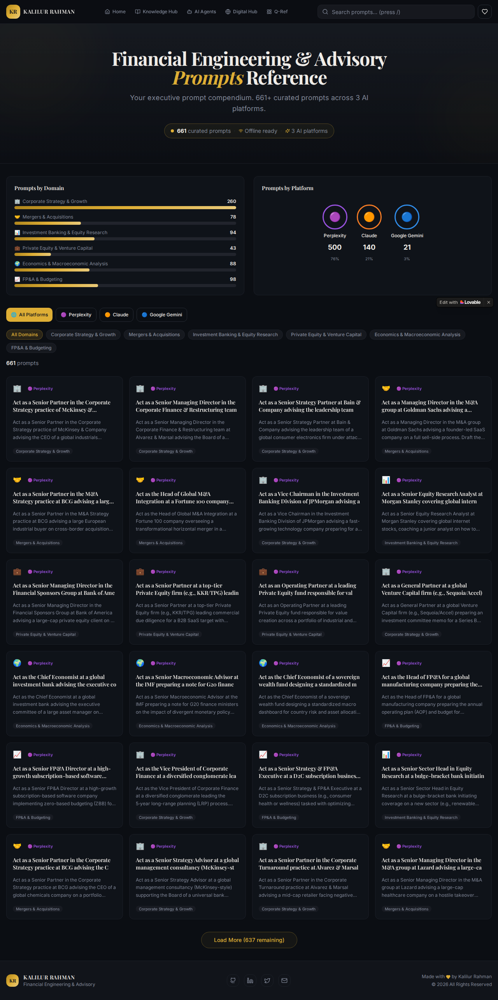

# Pages (`src/pages`) Directory

The `pages` directory contains the top-level route components for the **Financial Engineering & Advisory Prompts Reference** application. These components are responsible for rendering full application views and orchestrating the smaller UI components found in `src/components/`.

The application utilizes React Router DOM (`react-router-dom`) configured in `App.tsx` to handle navigation between these main views.

## 📁 Application Views

### 1. `Index.tsx`
This is the main, single-page view of the application (`/`). It is a complex orchestrator component that manages the core functionality of the prompt compendium.

  

- **Layout Structure:**
  - `Header`: The persistent top navigation and search bar.
  - `Hero`: The introductory section with dynamic statistics.
  - `Analytics`: The visual breakdown of prompts by platform and domain.
  - `FilterBar`: The interactive controls for refining the prompt list.
  - The Grid: A responsive flex/grid layout displaying `PromptCard`s.
  - "Load More": A pagination/infinite-scroll-like button to load additional prompts from the dataset.
  - `Footer`: The persistent bottom section.

- **State Management:**
  - Manages complex state including:
    - Search queries.
    - Active filters for platforms (Perplexity, Claude, Gemini).
    - Active filters for domains (Strategy, M&A, Equity Research, etc.).
    - Pagination state (e.g., number of prompts currently visible vs. total available).
  - Handles the filtering logic, combining search text, platform selections, and domain selections to derive the currently visible set of prompts.
  - Fetches the initial data set and statistics using the utility functions exported from `src/data/prompts.ts` (`getAllPrompts`, `getPromptStats`).

### 2. `Library.tsx`
The full **Prompt Library** view (`/library`). This dedicated page functions as the comprehensive catalog for all prompts.
- Provides advanced search and filtering mechanisms to query the 661+ prompts by domain and platform.
- Displays results in an immersive grid layout.
- Designed to help financial engineers and advisory professionals drill down efficiently to find exactly the right prompt.

### 3. `NotFound.tsx`
This is the fallback "404 Error" page rendered when a user navigates to an undefined route (`*` in React Router).

- It provides a simple, styled, and user-friendly error message indicating the page doesn't exist.
- It includes a clear call-to-action (a button or link) directing the user back to the main `Index` view (`/`), ensuring they aren't stuck on a dead end.
- It relies on `shadcn-ui` components to maintain consistent styling with the rest of the application.

## 🔗 Routing Architecture

The application is intentionally designed as a lean, client-side rendered Single Page Application (SPA). The routing logic is defined entirely within `App.tsx` and delegates full-page rendering to the components in this `pages/` directory.

- The application uses `BrowserRouter` for standard, clean URLs.
- The `Index.tsx` component is the heavy lifter, demonstrating a dashboard-style pattern where the majority of interaction happens without navigating to distinct sub-pages.
